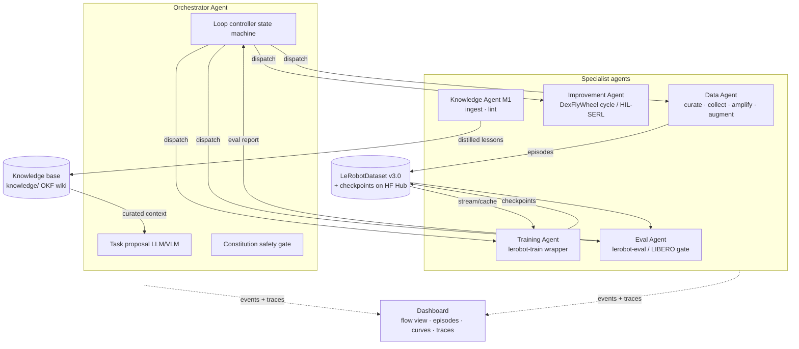

# LeAgents — Agentic LeRobot Pipeline

**Design document · July 2026**

**LeAgents** turns the LeRobot (Hugging Face) robotics pipeline — data collection, training, and evaluation — into an agentic system: an orchestration agent coordinates specialist agents through an automated **collect → train → eval → improve** loop, with a dashboard for visualizing the whole flow.

This design is grounded in a deep-research pass (July 2026) over the LeRobot codebase/docs and 2023–2026 papers. Claims marked **[verified]** survived 3-vote adversarial fact-checking against primary sources; items marked **[recommendation]** are design choices that were *not* independently verified and should be validated during implementation.

---

## 1. Why now

- **[verified]** LeRobot (v0.5.x, 25.5k★) is HF's official PyTorch robotics library with a hardware-agnostic control interface and **scriptable CLI entrypoints** (`lerobot-train`, `lerobot-eval` in `pyproject [project.scripts]`) — giving an orchestrator concrete subprocess-level hooks for automated iteration. ([repo](https://github.com/huggingface/lerobot), [v0.4.0 blog](https://huggingface.co/blog/lerobot-release-v040))
- **[verified]** LeRobot natively ships the 2026 policy SOTA — IL (ACT, Diffusion, VQ-BeT), VLA (π0, π0.5, SmolVLA, GR00T N1.5, XVLA, EO-1, MolmoAct2, WALL-OSS), RL (HIL-SERL, TDMPC) — all string-key registered in `src/lerobot/policies/factory.py`, so policies hot-swap via `--policy.type=X`. (Exception: HIL-SERL is a separate actor-learner gRPC workflow, not factory-registered.)
- **[verified]** **LeRobotDataset v3.0** (Parquet + MP4 shards, episode boundaries in relational metadata, Hub-native streaming via `StreamingLeRobotDataset`) is a single, documented data contract every pipeline stage can read and write (`create → add_frame → save_episode → finalize → push_to_hub`). ([docs](https://huggingface.co/docs/lerobot/lerobot-dataset-v3))
- **[verified]** The agentic-loop pattern has real precedents: **AutoRT** ran LLM/VLM-orchestrated collection on 20+ robots for 7 months (77k episodes, 6,650 tasks); **RoboGen** (ICML 2024) demonstrated the propose-generate-learn cycle; **DexFlyWheel** (NeurIPS 2025) closed the self-improvement loop, scaling 1 demo/task → 2,000+ demos.

What no one has shipped as **open source glue**: these loop patterns wired onto LeRobot's CLI + dataset contract with an observable dashboard. That is LeAgents's niche.

---

## 2. Architecture overview

**One shared contract, five agents — plus a knowledge layer from M1.** Every stage reads and writes LeRobotDataset v3.0 on the HF Hub; agents coordinate through the Orchestrator, never directly through each other's internals. From M1, a Knowledge Agent distills run events into a curated OKF wiki that feeds task proposal (§3.6).



### Loop control (the core state machine)

The Orchestrator makes one decision per cycle from the Eval Agent's delta:

```
COLLECT → TRAIN → EVAL ──▶ Δ success-rate?
                            ├─ ≥ promote threshold → PROMOTE checkpoint → IMPROVE (flywheel cycle)
                            ├─ improving but below   → ITERATE (more data on failing task variations)
                            ├─ plateaued on SmolVLA  → ESCALATE policy (--policy.type=pi05 / groot)
                            │                          (only if baseline ≥ escalate_floor — an
                            │                           all-zero plateau means under-training,
                            │                           so it iterates instead)
                            └─ regressed             → ROLLBACK + flag for human review
```

**Design rule from the research:** the one claim that *failed* adversarial verification was "RoboGen works as an unbounded, unattended data flywheel" (refuted 1–2; sim-only, needs supervision, skill verification is an acknowledged bottleneck). Therefore LeAgents **builds in verification gates and human checkpoints** at every loop boundary — auto-iterate within a budget, but promotion to a "blessed" checkpoint and constitution changes always require human approval.

---

## 3. Agent roles

### 3.1 Orchestrator Agent

Precedent: **AutoRT** (DeepMind, [arXiv:2401.12963](https://arxiv.org/abs/2401.12963)) — **[verified]** LLM task proposal + VLM scene grounding + a *robot constitution* safety filter ran a real fleet (52 robots, 7 months, 77k episodes). Note its qualification: LLM guidance operated at the orchestration/task-proposal level with human oversight retained — LeAgents adopts the same posture.

Responsibilities:
- **Task proposal**: LLM proposes the next tasks/variations to collect, conditioned on eval failures and dataset coverage stats.
- **Constitution gate**: a versioned, human-editable rules file (`constitution.yaml`) filters proposals (workspace limits, force/velocity caps, forbidden objects/actions). Every rejection is logged and visible in the dashboard.
- **Loop controller**: the deterministic state machine above — budgets (GPU-hours, episodes, cycles), retries, promote/iterate/escalate/rollback decisions, human-approval gates.

### 3.2 Data Agent

Three verified sub-capabilities composed into one pipeline:

| Stage | Precedent | Verified result |
|---|---|---|
| Task curation | **RoboGene** ([arXiv:2602.16444](https://arxiv.org/abs/2602.16444)) | Multi-agent LLM/VLM curation (proposal generator; feasibility/novelty/constraint evaluators; self-reflection refiner; LFU diversity sampling; HITL refinement). 18k+ real trajectories, 1,200 tasks, 3 embodiments; beat GPT-4o/Gemini-2.5-Pro task-gen baselines. *(medium confidence — single preprint)* |
| Amplification | **DexMimicGen** (ICRA 2025, [arXiv:2410.24185](https://arxiv.org/abs/2410.24185)) | ~350× amplification: 21K success-filtered sim demos from 60 human demos; productized as Isaac Lab Mimic / GR00T-Mimic (780K trajectories in 11 h). Sim-side; real transfer shown per-task via real-to-sim-to-real. |
| Visual augmentation | **GenAug** (RSS 2023, [arXiv:2302.06671](https://arxiv.org/abs/2302.06671)) | Depth-guided text-to-image diffusion re-renders collected demos (textures/objects/backgrounds/distractors) → ~40% generalization gain. 2023 codebase is unmaintained → **reimplement the pattern with a modern diffusion model**, don't depend on the repo. |

Output contract: episodes written via the v3.0 API (`LeRobotDataset.create → add_frame → save_episode → finalize → push_to_hub`).

**Quantity target [verified]:** SmolVLA official guidance is **~50 episodes per task with repeated coverage of each variation** (25 episodes → bad performance; figure is workspace/variation-density dependent — one community report needed 75). This is the Data Agent's default collection target and stopping criterion.

### 3.3 Training Agent

A subprocess wrapper over `lerobot-train` with structured config, log parsing, and checkpoint registry.

- **Default policy [verified]:** **SmolVLA** (`lerobot/smolvla_base`, 450M) — designed to be fine-tuned (not zero-shot); **20k steps ≈ 4 h on one A100** (~10 h on RTX 3090; ~18 ms/step, ~0.9 GB VRAM at inference). This sets the loop cadence: several full cycles per day on one GPU.
- **Escalation path [verified]:** π0.5 / GR00T N1.5 via `--policy.type` swap when SmolVLA plateaus. π0/π0.5 are native in-tree since v0.4.0, validated against OpenPI (97.5% vs 96.85% on LIBERO); checkpoints `lerobot/pi05_base`, `lerobot/pi05_libero` need only `pip install -e '.[pi]'`.
- **Data loading [verified empirically, July 2026]:** default to **local cache + Hub sync** rather than pure `StreamingLeRobotDataset` for in-loop training. Confirmed on lerobot 0.5.1: `--dataset.streaming=true` yields empty batches with action-chunking policies (SmolVLA/ACT/π0) because the streaming loader cannot serve delta-timestamp action windows; use `--dataset.episodes=[...]` for partial shard downloads of large datasets instead (HuggingFaceVLA/libero is ~70 GB). Other known rough edges: issue #3080 decoding failures, #3672 shuffle-buffer shard-hopping I/O, segfault with `DataLoader num_workers>0`.

### 3.4 Eval Agent

- **Sim gate [verified]:** `lerobot-eval --env.type=libero` — LIBERO is officially supported since v0.4.0, **130 tasks across 5 suites** (10+10+10+90+10), MuJoCo backend, Linux-only extra. This is the automated promotion gate.
- **Protocol:** fixed seeds, per-suite and per-task success rates, N rollouts per task; A/B comparison of candidate vs. currently-blessed checkpoint; paired statistics before declaring a delta real.
- **Real-robot eval:** a held-out set of task variations scored by (a) a learned success classifier (see HIL-SERL's reward classifier) with (b) periodic human spot-checks — automated success labeling reliability is an **open question**, so human audit stays in the loop.
- SimplerEnv (real-to-sim eval) is a candidate second gate **[recommendation — unverified]**.

### 3.5 Improvement Agent (the self-improvement flywheel)

Template **[verified]**: **DexFlyWheel** (NeurIPS 2025, [arXiv:2509.23829](https://arxiv.org/abs/2509.23829)) — closed-loop cycles of:

1. **IL**: train base policy on current dataset (this is the Training Agent's job);
2. **Residual RL**: train a residual policy on top of the *frozen* base;
3. **Rollout collection**: run the composed policy, **keep only success-filtered trajectories**;
4. **Augmentation**: environment/spatial (+ GenAug visual) augmentation of the kept rollouts;
5. Expanded dataset → next cycle's base policy.

Verified result: from **1 human demo per task → 2,000+ successful demos across 500+ scenarios** (~500×/task), outperforming baseline data-generation methods. Caveat: demos generated in simulation; real-world validation via digital twin only (78.3% dual-arm lift).

**Real-robot leg [verified]:** LeRobot ships **HIL-SERL** (`.[hilserl]` extra; `lerobot.rl.actor` / `lerobot.rl.learner` gRPC actor-learner + trained binary reward classifier + human interventions) as the on-hardware RL workflow. Whether HIL-SERL composes cleanly with sim-side flywheel amplification is an **open question** — treat as an experiment track, not a dependency.

### 3.6 Knowledge Agent & the Knowledge Layer (M1)

*Added July 2026. Grounded in web sources (not adversarially verified): [Karpathy's LLM Wiki](https://gist.github.com/karpathy/442a6bf555914893e9891c11519de94f) (Apr 2026 — LLM-as-compiler over immutable raw sources producing an interlinked markdown wiki) and Google's [Open Knowledge Format (OKF)](https://github.com/GoogleCloudPlatform/knowledge-catalog/blob/main/okf/SPEC.md) (June 2026 — vendor-neutral spec: a directory of markdown + YAML frontmatter, explicit producer/consumer independence).*

**Problem it solves:** without this layer the loop accumulates *data* (events, checkpoints, eval reports) but not *lessons*. The self-improvement flywheel (§3.5) grows the dataset; the knowledge layer grows the system's understanding of *why* runs succeed or fail, and feeds that back into task proposal.

**Structure — Karpathy's three layers mapped onto LeAgents:**

| Layer | Karpathy LLM Wiki | LeAgents |
|---|---|---|
| 1 — Raw sources (immutable; LLM reads, never edits) | curated documents | already exists: `events.jsonl`, eval reports, train logs, SQLite run history |
| 2 — The wiki (LLM-owned, interlinked markdown) | entity/concept pages | `knowledge/` — an **OKF bundle** (markdown + YAML frontmatter): per-**task** pages (failure modes, data strategies that worked), per-**policy** pages (e.g. "SmolVLA needs ~50 episodes per variation; 25 failed"), per-**experiment** lesson pages | 
| 3 — Schema/conventions file | `CLAUDE.md`/`AGENTS.md` | `knowledge/KNOWLEDGE.md` — page structure, frontmatter schema, update workflows, lint rules |

**Knowledge Agent — two operations** (mirroring the LLM Wiki workflow):

1. **Ingest** — dispatched by the Orchestrator after each cycle (`run_finished`): reads the cycle's events and eval report (Layer 1), updates the affected task/policy/experiment pages (Layer 2). One cycle typically touches a handful of pages, like the wiki pattern's multi-page updates per source.
2. **Lint (health check)** — periodic pass over the wiki: contradictions (a task page claiming a strategy works while recent eval deltas say otherwise), stale claims, and coverage gaps. Findings are surfaced as *proposals for the next experiments* — closing a second, slower improvement loop on top of the data flywheel.

**Consumers (OKF producer/consumer independence):**
- **Proposer (§3.1)** — the M1 LLM proposer reads the relevant task/policy pages into context before proposing, replacing raw-history dumps with curated, compounding knowledge. This is the primary consumer.
- **Data Agent curation (§3.2)** — feasibility/constraint evaluators read constraint pages.
- **Dashboard (§5)** — renders the wiki as a browsable view.
- **Humans** — pages are plain markdown; maintainers can author or correct pages directly, and agents consume them identically.

**Rules (consistent with §2 and §4):**
- Knowledge pages are **advisory context only — never control flow**. Promote/iterate/escalate/rollback stays a pure function of eval deltas.
- Every claim on a page carries **provenance** (run/cycle ids, event refs) in frontmatter, and a confidence status (`observed-once | replicated | human-confirmed`) — the same verified/unverified discipline this document uses.
- Layer 1 artifacts are immutable; the Knowledge Agent writes only under `knowledge/`.
- The bundle is vendor-neutral by construction (OKF), so it can be published to the HF Hub alongside datasets and consumed by other tools or teams' agents.

---

## 4. Orchestration framework  **[recommendation — zero claims in this area survived verification; re-validate by prototyping]**

The research pass produced *no verified claims* comparing Claude Agent SDK / LangGraph / OpenAI Agents SDK / CrewAI. Practitioner sources surfaced (Anthropic's long-running-agent harness guidance; critiques that framework checkpointing ≠ durable execution) suggest this shape:

- **Keep loop control deterministic and boring**: the Orchestrator's state machine is plain Python + a persistent job store (SQLite/Postgres) with idempotent, resumable steps — *not* an LLM deciding control flow, and not framework-checkpoint magic. Long training/eval subprocesses must survive orchestrator restarts (record PID/job-id, re-attach on resume).
- **Use LLM agents as subroutines** at the decision points that genuinely need intelligence: task proposal, failure-mode analysis of eval reports, curation/feasibility review. **Claude Agent SDK** is the default here (first-class tool use, subagents, MCP); LangGraph is the alternative if graph-style workflow definition is preferred.
- **Escape hatch**: if the loop outgrows a single host, move the state machine onto a durable-execution runtime (e.g., Temporal) rather than deepening framework lock-in.

---

## 5. Dashboard & observability  **[flow view v1 implemented July 2026; embeds still recommendations]**

*Status: the flow view ships as FastAPI + one static page with no build step (`leagents dash`, `leagents/dashboard/`) — runs → cycles → decisions live via polling, per-cycle eval chart, event log, knowledge browser. The API is the stable surface; a React shell and the Rerun/WandB/OTel embeds below remain planned.*

One pane, four views, backed by an event bus (every agent emits structured events to the job store; dashboard reads it):

| View | Tool | Why |
|---|---|---|
| **Flow view** | FastAPI + React (or Next.js); render the loop state machine live: current cycle, stage, budgets, pending human gates | This is the "플로우를 볼 수 있는 대시보드" core — nothing off-the-shelf does it; own it |
| Episode/trajectory replay | **Rerun.io** (has an official LeRobot example) | Purpose-built robot data viz; embeddable web viewer |
| Training curves | **WandB** (or Trackio) — `lerobot-train` already integrates WandB | Zero extra work; embed run pages |
| Agent traces | **OpenTelemetry GenAI semantic conventions** → any OTel backend (LangSmith optional) | Standards-based; avoids tracing lock-in |

Human-approval gates (checkpoint promotion, constitution edits, real-robot dispatch) surface in the flow view as blocking cards with approve/reject.

---

## 6. Security & operational caveats (from verified research)

1. **CVE-2026-25874** — critical unauthenticated **RCE via `pickle.loads()` in LeRobot's async-inference gRPC path** (validated on v0.4.3; fix slated for v0.6.0). LeAgents must **avoid or sandbox async-inference** until ≥ v0.6.0: never expose the gRPC port beyond localhost, run inference workers in a container with no secrets. The HIL-SERL actor-learner path is also gRPC — same network posture applies.
2. **Maintenance risk** — LeRobot founders left HF in Dec 2025; project continues under a new tech lead who calls it "primarily a research and prototyping tool." Production hardening (retries, validation, sandboxing) is LeAgents's responsibility. Pin LeRobot versions; the project moves fast (v0.4.0 Oct 2025 → v0.5.1 Apr 2026; re-check format/policy roster at implementation time).
3. **Sim-to-real honesty** — headline amplification numbers (350×/500×) are **simulation-side**; real transfer was demonstrated per-task only. Dashboard must display sim and real metrics separately; never let sim success promote a real-robot checkpoint.
4. **Dataset v3 rough edges** — see §3.3; default to local cache + Hub sync.

---

## 7. Repository layout

```
leagents/
├── leagents/
│   ├── orchestrator/        # state machine, budgets, constitution gate, task proposal
│   │   ├── loop.py          # deterministic cycle controller (COLLECT→TRAIN→EVAL→IMPROVE)
│   │   ├── constitution.py  # yaml-driven safety filter + audit log
│   │   └── proposer.py      # LLM task proposal (Claude Agent SDK)
│   ├── agents/
│   │   ├── data_agent/      # curation (RoboGene-style), collection drivers, mimicgen/genaug adapters
│   │   ├── train_agent/     # lerobot-train subprocess wrapper, checkpoint registry
│   │   ├── eval_agent/      # lerobot-eval wrapper, LIBERO gate, A/B stats, success classifier
│   │   ├── improve_agent/   # DexFlyWheel cycle, residual RL, HIL-SERL adapter (experimental)
│   │   └── knowledge_agent/ # (M1) ingest run events → OKF wiki pages; periodic lint pass
│   ├── contracts/           # LeRobotDataset v3 read/write helpers, checkpoint & eval-report schemas
│   ├── events/              # event bus + OTel GenAI tracing
│   └── store/               # job store (SQLite→Postgres), resumable job records
├── dashboard/               # FastAPI backend + React flow view; embeds Rerun/WandB
├── knowledge/               # (M1) OKF bundle: task/policy/experiment pages + KNOWLEDGE.md schema
├── configs/                 # loop budgets, policy escalation ladder, eval protocol, constitution.yaml
├── docs/
└── tests/                   # sim-only e2e: tiny dataset → 1 full cycle on LIBERO spatial suite
```

## 8. Milestones

- **M0 — Sim-only MVP (the honest demo).** One full automated cycle on LIBERO: seed dataset → SmolVLA fine-tune (~4 h/A100) → `lerobot-eval` gate → iterate-or-promote decision. CLI only, events logged. *Everything here uses only [verified] capabilities.*
- **M1 — Flywheel + knowledge.** DexFlyWheel-style improvement cycle in sim (residual RL + success-filtered rollouts + augmentation); policy escalation ladder (SmolVLA → π0.5); dataset coverage stats driving task proposal. **Knowledge layer (§3.6):** `knowledge/` OKF bundle + Knowledge Agent (post-cycle ingest, periodic lint); the LLM proposer reads task/policy pages as its context — behind a provider-agnostic LLM adapter so any model (Claude, GPT, local) can drive it.
- **M2 — Dashboard.** Flow view + Rerun episode replay + WandB embeds + OTel traces; human-approval gates in UI.
- **M3 — Real robot (experimental track).** Teleop collection target (~50 eps/variation), held-out real eval with success classifier + human spot-checks, HIL-SERL adapter behind a sandbox (post-CVE-fix LeRobot ≥ 0.6.0).

**Backlog** — tracked as GitHub issues under the [v0.1.0 — DX & onboarding milestone](https://github.com/ratelcode/LeAgents/milestone/1): Docker image + compose + devcontainer ([#1](https://github.com/ratelcode/LeAgents/issues/1)), `leagents doctor`/`setup` self-diagnosis ([#2](https://github.com/ratelcode/LeAgents/issues/2)), Colab quickstart ([#3](https://github.com/ratelcode/LeAgents/issues/3)), pixi env for sudo-less system deps ([#4](https://github.com/ratelcode/LeAgents/issues/4)), bundled demo run ([#5](https://github.com/ratelcode/LeAgents/issues/5)).

## 9. Key references

**Foundation:** [LeRobot](https://github.com/huggingface/lerobot) · [Dataset v3](https://huggingface.co/docs/lerobot/lerobot-dataset-v3) · [v0.4.0 release](https://huggingface.co/blog/lerobot-release-v040) · [SmolVLA](https://arxiv.org/abs/2506.01844) ([docs](https://huggingface.co/docs/lerobot/en/smolvla)) · [HIL-SERL docs](https://huggingface.co/docs/lerobot/hilserl)
**Orchestrated collection:** AutoRT [arXiv:2401.12963](https://arxiv.org/abs/2401.12963) · RoboGene [arXiv:2602.16444](https://arxiv.org/abs/2602.16444)
**Loop / self-improvement:** RoboGen (ICML 2024) [arXiv:2311.01455](https://arxiv.org/abs/2311.01455) · DexFlyWheel (NeurIPS 2025) [arXiv:2509.23829](https://arxiv.org/abs/2509.23829) · RoboCat [arXiv:2306.11706](https://arxiv.org/abs/2306.11706)
**Data generation/augmentation:** DexMimicGen (ICRA 2025) [arXiv:2410.24185](https://arxiv.org/abs/2410.24185) · GenAug (RSS 2023) [arXiv:2302.06671](https://arxiv.org/abs/2302.06671)
**Eval:** [LIBERO](https://github.com/Lifelong-Robot-Learning/LIBERO) · [SimplerEnv](https://github.com/simpler-env/SimplerEnv)
**Ops/observability:** [Anthropic: effective harnesses for long-running agents](https://www.anthropic.com/engineering/effective-harnesses-for-long-running-agents) · [Rerun × LeRobot example](https://rerun.io/examples/generative-vision/lerobot) · [OTel GenAI observability](https://opentelemetry.io/blog/2026/genai-observability/)
**Knowledge layer:** [Karpathy LLM Wiki gist](https://gist.github.com/karpathy/442a6bf555914893e9891c11519de94f) · [Google OKF spec](https://github.com/GoogleCloudPlatform/knowledge-catalog/blob/main/okf/SPEC.md) · [OKF on Google Cloud blog](https://cloud.google.com/blog/products/data-analytics/how-the-open-knowledge-format-can-improve-data-sharing)
