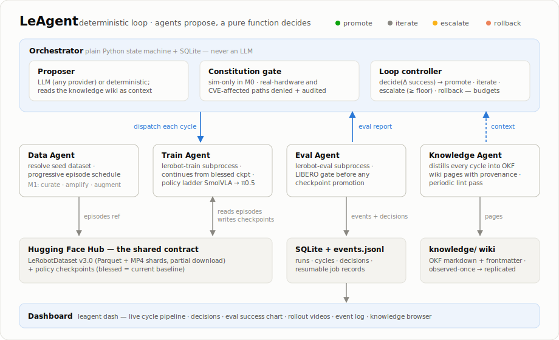

# LeAgents

Agentic orchestration for the [LeRobot](https://github.com/huggingface/lerobot) robotics pipeline — an orchestrator drives an automated **collect → train → eval → improve** loop over [LeRobotDataset v3.0](https://huggingface.co/docs/lerobot/lerobot-dataset-v3), with a deterministic loop controller, a constitution safety gate, verification gates before promotion, and (M2) a dashboard for visualizing the flow.

<p align="center"></p>

Architecture, research grounding (verified 2023–2026 papers), and roadmap: **[DESIGN.md](DESIGN.md)**.

## Status — v0.0.4

| Milestone | Scope | Status |
|---|---|---|
| **M0** | Sim-only loop on LIBERO: seed dataset → SmolVLA fine-tune → `lerobot-eval` gate → promote/iterate/escalate/rollback | ✅ pipeline verified end-to-end on a real GPU (PushT + LIBERO smoke configs); full-scale training run pending |
| **M1** | DexFlyWheel-style self-improvement, RoboGene-style task curation, policy escalation, OKF knowledge layer (Karpathy-wiki-style, DESIGN.md §3.6) + provider-agnostic LLM proposer | 🚧 knowledge layer + LLM adapter landed |
| **M2** | Flow dashboard (Rerun episode replay, WandB curves, OTel agent traces) | 🚧 flow view v1 landed: runs → cycles → decisions live, eval chart, event log, knowledge browser (`leagents dash`) |
| M3 | Real robot: teleop collection, HIL-SERL adapter (requires lerobot ≥ 0.6.0, see CVE note in DESIGN.md §6) | planned |

What works today: the full loop state machine with budgets, the constitution gate, SQLite job store, JSONL event log, subprocess wrappers for `lerobot-train` / `lerobot-eval`, the OKF knowledge layer (`knowledge/` pages with provenance, updated every cycle, linted), the DexFlyWheel data path (success-filtered rollout harvesting → accumulated mix → adaptation training), and a provider-agnostic LLM adapter (`llm: anthropic:*|openai:*[@base_url]`, or none at all — every flow has a deterministic fallback). All covered by tests that run without a GPU or lerobot installed.

## First full-scale autonomous run (2026-07-04)

One M0 run on a single RTX 5070 Ti (16 GB), fully autonomous — 3 cycles, 6.1 GPU-hours, zero human intervention, every decision/event/knowledge-page update logged:

| Cycle | Data | Train | LIBERO spatial eval (100 episodes) | Decision |
|---|---|---|---|---|
| 0 | 40 episodes | 20k steps from `smolvla_base` (loss → 0.030) | 0% success — arm reaches targets, never completes | **promote** (baseline) |
| 1 | 80 | 20k steps, continued from the blessed checkpoint | 0% | **iterate** |
| 2 | 160 | 20k steps | 0% | **iterate** — the `escalate_floor` guard correctly refused to escalate a 0%-plateau to a bigger policy |

The 0% success is the expected outcome of the data budget, not a pipeline failure: 4→16 episodes per task versus the ~50-per-variation guidance the design research verified for SmolVLA. This run validates the *loop* — budgets held, weights carried over, and the decision function behaved exactly as specified. The next run scales the data schedule to 200→500 episodes (20→50 per task).

## Quickstart

```bash
pip install -e ".[dev]"
pytest

# dry run — no GPU, no lerobot; synthetic eval scores exercise the decision logic
leagents run -c configs/m0_libero.yaml --dry-run

# real run (Linux; needs a GPU and the LIBERO extras)
pip install -e ".[lerobot]"
leagents run -c configs/m0_libero.yaml

# inspect runs, cycles, decisions, blessed checkpoints
leagents status

# flow dashboard — runs, cycle pipeline, decisions, eval chart, events, knowledge
pip install -e ".[dash]"
leagents dash            # → http://127.0.0.1:8321
```

## How the loop decides

Each cycle trains a candidate checkpoint and evaluates it on LIBERO. The decision is a pure function of success-rate deltas vs. the blessed baseline (`leagents/orchestrator/decision.py`):

- **promote** — candidate beats baseline by ≥ `promote_delta`; it becomes the new blessed checkpoint
- **iterate** — small improvement; collect more data on failing task variations
- **escalate** — plateaued for `plateau_cycles`; move up the policy ladder (SmolVLA → π0.5)
- **rollback** — regression; the blessed checkpoint stands

Control flow is deterministic Python persisted to SQLite — LLM agents (task proposal, curation; M1) only make proposals *inside* the gates, never control-flow decisions.

## Layout

```
leagents/
├── orchestrator/   # loop controller, decision logic, constitution gate, proposer
├── agents/         # data / train / eval / improve agents (LeRobot CLI wrappers)
├── contracts/      # typed records: DatasetRef, CheckpointRecord, EvalReport
├── events/         # JSONL event bus (dashboard reads this in M2)
└── store/          # SQLite job store (runs, cycles, checkpoints)
configs/            # m0_libero.yaml, constitution.yaml
tests/              # loop e2e with fake runners — no GPU needed
```

## License

Apache-2.0
